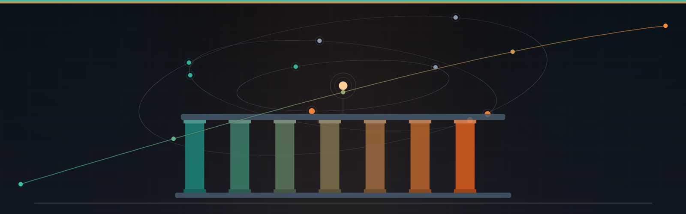

  

  
  
  
  
  

# Documentação Oficial: Sistema de Informações de Crédito (SCR) e Governança Financeira

> **AI Engineer | Especialista em Governança 4.0 e Qualidade | Engenheiro Químico**  
> [Mauá, SP](mailto:ornelas.tozato@gmail.com) | [LinkedIn](https://www.linkedin.com/in/rafaeltozato81) | [GitHub](https://github.com/Rafael-TOZATO) | [Portfólio PWA](https://tozato-dev-hub.vercel.app) | [Medium](https://medium.com/@ornelas.tozato)

Este documento consolida as diretrizes oficiais do Banco Central (BCB), o funcionamento prático do SCR e sua aplicação estratégica na gestão de passivos e no desenvolvimento de carreira.

---

## 1. O Relatório de Empréstimos e Financiamentos (SCR)
O SCR é uma ferramenta do sistema Registrato que consolida dívidas e compromissos financeiros de pessoas físicas e jurídicas junto a instituições do Sistema Financeiro Nacional.

* **Conteúdo e Finalidade:** O relatório apresenta saldos devedores, limites de crédito (como cheque especial e cartões) e o status das operações (em dia ou em atraso). Ele serve para o cidadão conhecer seus contratos, avaliar seu endividamento, identificar fraudes e planejar sua vida financeira.
* **Classificação das Dívidas:** As dívidas são classificadas como "Em dia" (parcelas não vencidas ou com até 14 dias de atraso) e "Vencidas" (atraso superior a 14 dias). Importante destacar que, seguindo a Resolução CMN 4.966/2021, dívidas vencidas e em prejuízo agora são detalhadas por faixa de atraso.
* **Acesso:** A consulta é feita exclusivamente pelo sistema Registrato, exigindo uma Conta Gov.br de nível prata ou ouro com verificação em duas etapas (2FA).

---

## 2. Dinâmica de Atualização e Responsabilidade
Um ponto crítico destacado nas fontes é que o SCR não é um cadastro de inadimplentes em tempo real, mas um banco de dados histórico.

* **Prazo de Atualização:** As instituições financeiras enviam dados mensalmente ao BCB. Assim, após o pagamento de uma dívida, a atualização no relatório ocorre apenas no final do mês seguinte.
* **O Histórico Não Muda:** O pagamento de uma pendência regulariza a situação futura, mas o histórico de meses anteriores em que a dívida estava atrasada permanece inalterado no relatório. As dívidas atrasadas ficam visíveis por um período de 5 anos.
* **Responsabilidade pelos Dados:** As instituições (bancos, cooperativas, financeiras, etc.) são as únicas responsáveis pela inclusão, correção e exclusão das informações. Em caso de erro ou dívida não reconhecida, o cidadão deve procurar primeiramente a instituição credora.

---

## 3. Governança Financeira e Impacto Profissional
O estudo de caso "Governança Financeira & Carreira 4.0" demonstra como os dados do SCR e a gestão de débitos influenciam a trajetória profissional, especialmente em indústrias de alto compliance.

* **Compliance Pessoal:** A limpeza do CPF e o saneamento de dados no SCR são vistos como uma blindagem para o background check em auditorias de RH. No caso apresentado, o profissional utilizou estratégias de quitação acelerada, obtendo um desconto médio de 71% em suas dívidas.
* **Estratégia de Recuperação:** O uso do PIX é recomendado para baixa imediata da negativação e restauração da confiança bancária. A governança pessoal é definida como o fundamento para a liderança profissional, permitindo foco total no desempenho técnico.

---

## 4. Análise do Relatório Detalhado (Exemplo Prático)
O relatório detalhado fornecido como fonte ilustra a estrutura de dados que o BCB armazena.

* **Estrutura de Exibição:** O documento lista cada instituição (como Banco Inter, Santander e Original) e detalha o valor das operações "Em dia" e "Vencida" mês a mês.
* **Terminologia Técnica:**
  * **Crédito a liberar:** Valores contratados que dependem de condições para liberação (ex: financiamento agrícola).
  * **Coobrigações:** Garantias prestadas (como avais ou fianças) onde o cidadão é coresponsável.
  * **Limites de Crédito:** Valores contratados e ainda não utilizados pelo cliente.

---

## 5. Acesso ao Caderno Interativo (NotebookLM)
* **Link do Notebook:** [https://notebooklm.google.com/notebook/9d5df78d-8c92-4c17-bd50-b10066b866a9](https://notebooklm.google.com/notebook/9d5df78d-8c92-4c17-bd50-b10066b866a9)

---

## 6. Considerações Finais
O Sistema de Informações de Crédito (SCR) do Banco Central transcende a mera consulta de débitos, configurando-se como um instrumento essencial de governança pessoal e transparência sistêmica. Ao consolidar o histórico financeiro do cidadão em âmbito nacional, a ferramenta exige rigor, planejamento e monitoramento constante.

---

## Autor

**Rafael Ornelas Tozato**

Engenharia Química | Garantia da Qualidade | Governança 4.0

### Contato

- LinkedIn: [linkedin.com/in/rafaeltozato81](https://www.linkedin.com/in/rafaeltozato81)
- GitHub: [github.com/Rafael-TOZATO](https://github.com/Rafael-TOZATO)
- Medium: [medium.com/@ornelas.tozato](https://medium.com/@ornelas.tozato)
- DIO: [web.dio.me/users/ornelas_tozato](https://web.dio.me/users/ornelas_tozato)
